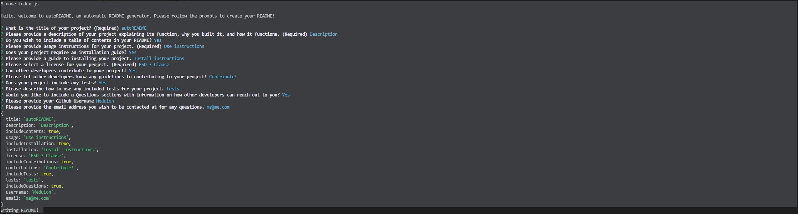

# autoREADME

  

  ## Description

  autoREADME is a command line README generator for your projects.

  ## Contents
  
  - [Usage](#usage)
  - [Installation](#installation)
  - [Contributions](#contributions)
  - [Tests](#tests)
  - [Questions](#questions)

  ## Usage

  autoREADME will provide the user a series of prompts to answer about how they wish to structure their README and what information they would like to provide. Simply   follow the prompts to create your README!
  
  

  ## Installation
  
  Use node.js from your command line to run autoREADME then follow the prompts. Your markdown file will be generated at the end.

  ## License

  This project is licensed under BSD 3-Clause. For more information (if applicable), please click the following button to learn more:

  

  ## Questions
  
  For any questions or comments please reach out to me through github.
  
  https://github.com/Meduion
  
